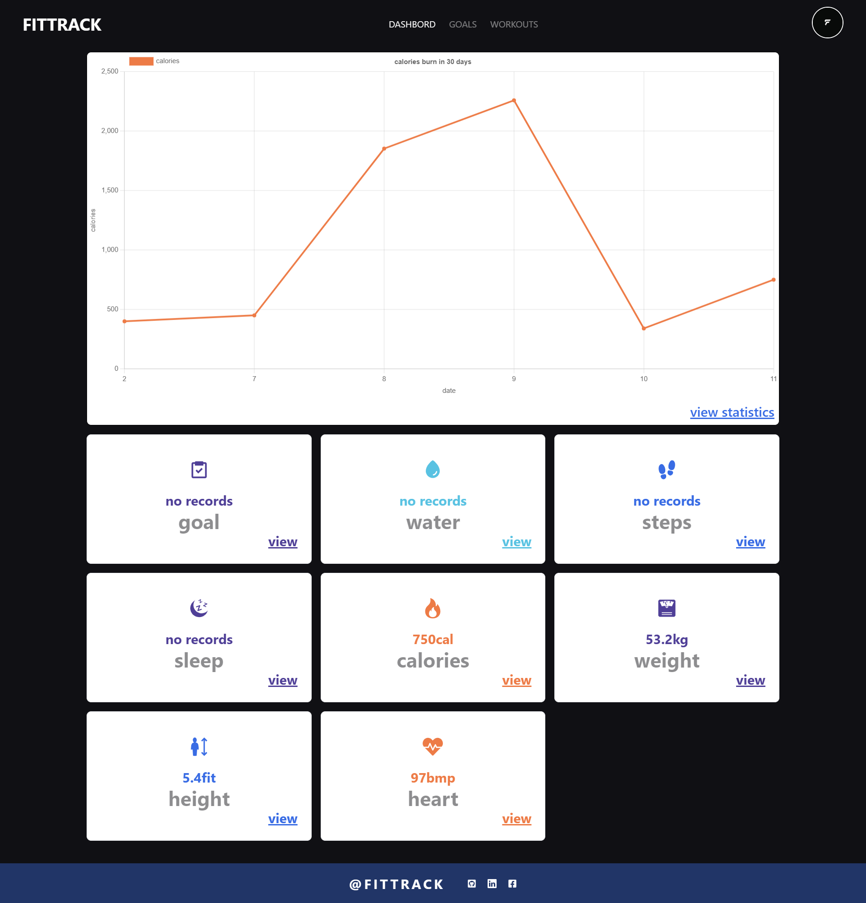
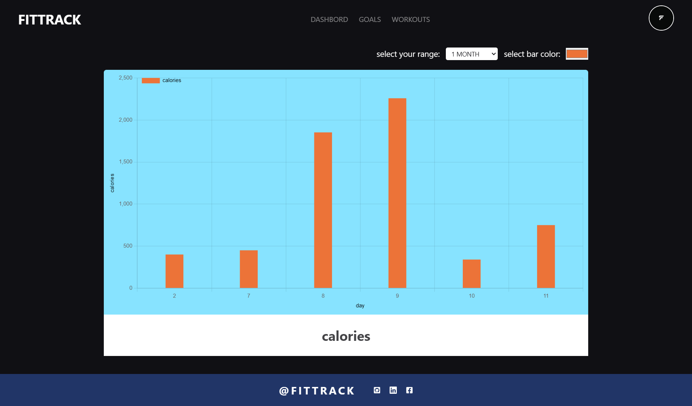
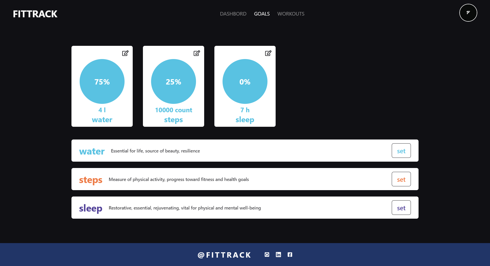
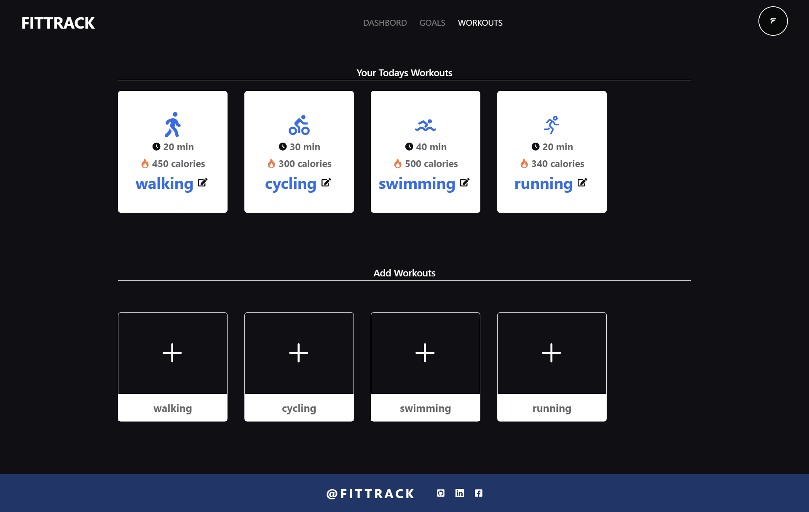
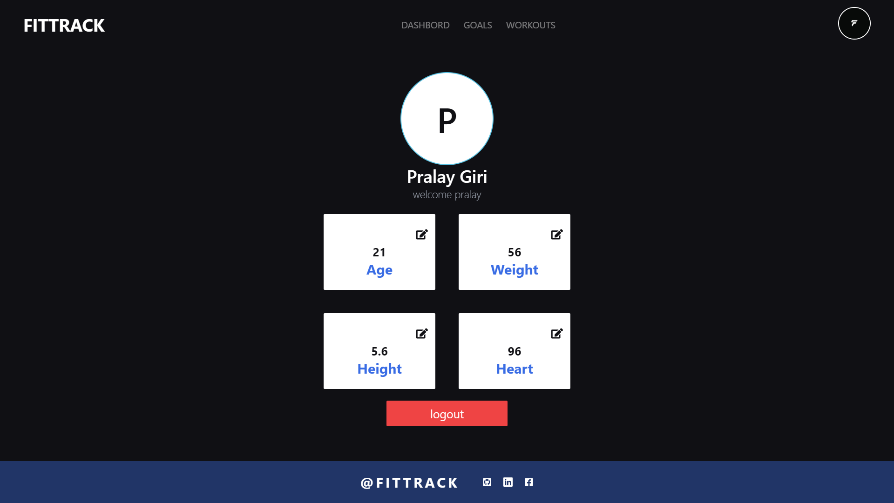

# FITNESS_TRACKER

### Website for track your daily rutine

> screensorts of website

1. Dashbord:

    - 

2. Profile:
    -   - 
3. Goals:
    -   - 
4. Workouts:
    -   - 
5. Profile:
    -   - 

-   ## for clone and run the app use this commands

1. clone the repo

    - ```sh
      git clone https://github.com/pralay-giri/finess_tracker
      ```
